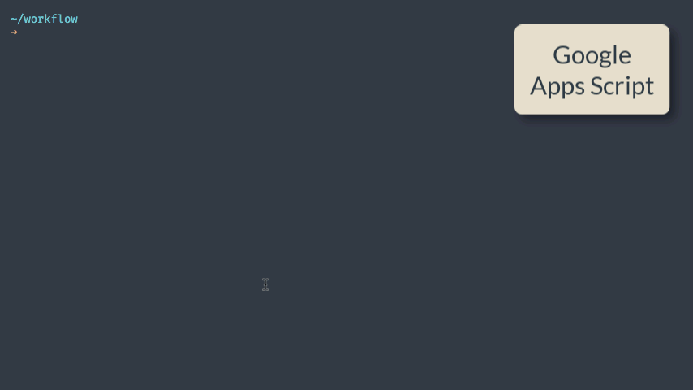

# Google Apps Script Quickstart Code

## Getting Started

**1.** Install npm repositories.

```bash
npm install
```

**2.** Authorize Google clasp.

```bash
npx clasp login
```

**3.** Create a new Google Script with [clasp create](https://github.com/google/clasp?tab=readme-ov-file#create).

```bash
npx clasp create --type sheets --title "My Project"
```

**4.** Include the necessary [OAuth Scopes](./scopes.md) in the [appsscript.json](./appsscript.json) file

**5.** Deploy the project

```bash
npm run deploy
```

The `dist` directory contains the bundled code that is pushed to Google Apps Script.



### Enable JavaScript v8 Runtime

Inside the Google Apps Script editor, select View > Show project manifest to open the `appsscript.json` manifest file in the editor. Add a new `runtimeVersion` field and set the value to `V8`. Save your script.


### The .claspignore file

The `.claspignore` file allows you to specify file and directories that you do not wish to not upload to your Google Apps Script project via `clasp push`.

The default `.claspignore` file in the Apps Script Starter kit will push all the JS and HTML inside the `rootDir` folder and ignore all the other files.

### Using Git with Google Apps Script


Create a new repository in Github and make a note of the URL of the new repository. Next, open the terminal and run the above commands to push your Apps Script project to Github.

## Custom Google Sheet functions

Please read [the tutorial](./FUNCTIONS.md) on how to write custom functions for Google Sheets using Apps Script.

## Testing your Google Apps Script code

You can run tests with jest using

```bash
npm run test
```

This has limitations:

- You _can_ test code that has no dependencies to Google App Script code, e.g.

```google-app-script
const hasCpuTime = () => !(Date.now() - START_TIME > ONE_MINUTE * 4);
```

- You _can not_ test code that has dependencies to Google App Script code, e.g.

```google-app-script
function notTestable() {
    Logger.log("notTestable"); // <-- Google Apps Script function. Not callable in dev
    SpreadsheetApp.getUi(); // <-- Google Apps Script function. Not callable in dev
    ...
}
```

Check out [jest 'expects' here](https://jestjs.io/docs/expect)

## Attribution

This project is based on [app-sscript-starter](https://github.com/labnol/apps-script-starter).

## License

[MIT License](https://github.com/labnol/gas-quickstart/blob/master/LICENSE) (c) Ryan Ogden
